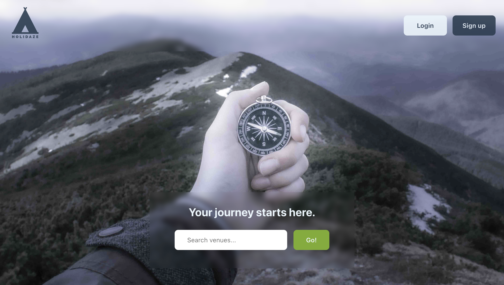
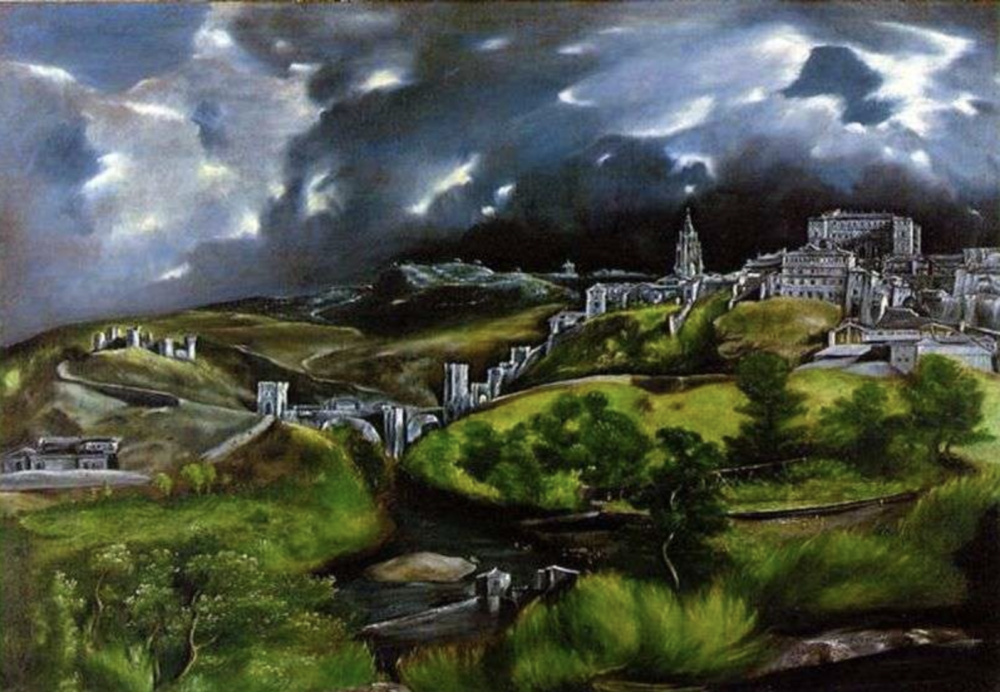

# Holidaze | Project Exam 2

## Summary

This project has been delivered as part of my Frontend Development programme at the Norwegian School of Technology and Digital Media, Noroff. It consists of a React frontend based on an API provided by the school. It is a platform where travellers can find venues to book and where venue owners can manage their properties.

## Built with

- React (CRA)
- [Noroff API](https://docs.noroff.dev/)

## JSDocs

The utility functions in this project are documented with JSDocs.

## Instructions

- `npm install`: Starts node and installs dependencies
- `npm run start`: Opens project in development mode
- `npm run lint`: Runs eslint

## External libraries

- [StyledComponents](https://styled-components.com)
- [StyledIcons](https://styled-icons.dev)
- [ReactAuthKit](https://www.npmjs.com/package/react-auth-kit)
- [ReactDatePicker](https://www.npmjs.com/package/react-datepicker)
- [ReactSpinners](https://www.npmjs.com/package/react-spinners)
- [ReactSpring](https://www.react-spring.dev)
- [Yup](https://www.npmjs.com/package/yup)

## Privacy

The deployed version of this project (https://holidaze-ng.netlify.app/) has Hotjar enabled.

## Design

The AA-compliant colour palette for this project is inspired by a 1596 painting called _View of Toledo_, by Domḗnikos Theotokópoulos. Travelling is the main theme of this painting -- the artist was a traveller himself. I found it would be a fitting starting point to develop the colour palette for the Holidaze project:

## Contributions

For suggestions and contributions, please fork this repository and open new pull requests. The main branch is protected. You're also welcome to post post on the issues tab.

## Deliverables

- [Gantt chart for project timing](https://github.com/NehGuk/holidaze-ng/blob/90b899339cdc93c31a7347e78f647beeefd4caa6/src/assets/gantt-chart.pdf)
- [Kanban project board](https://trello.com/b/FfHpyYcq/overview)
- [Information architecture diagram](https://www.figma.com/file/t3D9vU3tb32x53wSlld48Y/holidaze-information-architecture-diagram?type=whiteboard&node-id=0-1)
- [Style guide](https://xd.adobe.com/view/44d2016e-94c7-426d-a2b6-212193051673-1181/)
- [Mid-fidelity design prototype](https://xd.adobe.com/view/a31cc755-a746-43d3-9c3c-61ea6b5613a5-f64f/)
- [Repository link](https://github.com/NehGuk/holidaze-ng)
- [Hosted application demo link](https://holidaze-ng.netlify.app/)
